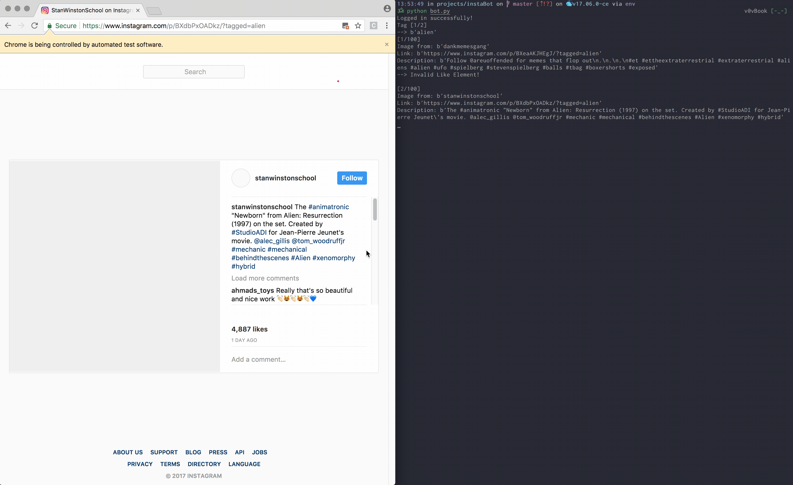

## instaBot

A little Instagram helper that likes, follows, and comments on some friendly channels.

 Built off of [InstaPy](https://github.com/timgrossmann/InstaPy/) using Docker, hosted on [DigitalOcean](https://cloud.digitalocean.com/).

### Licenses

